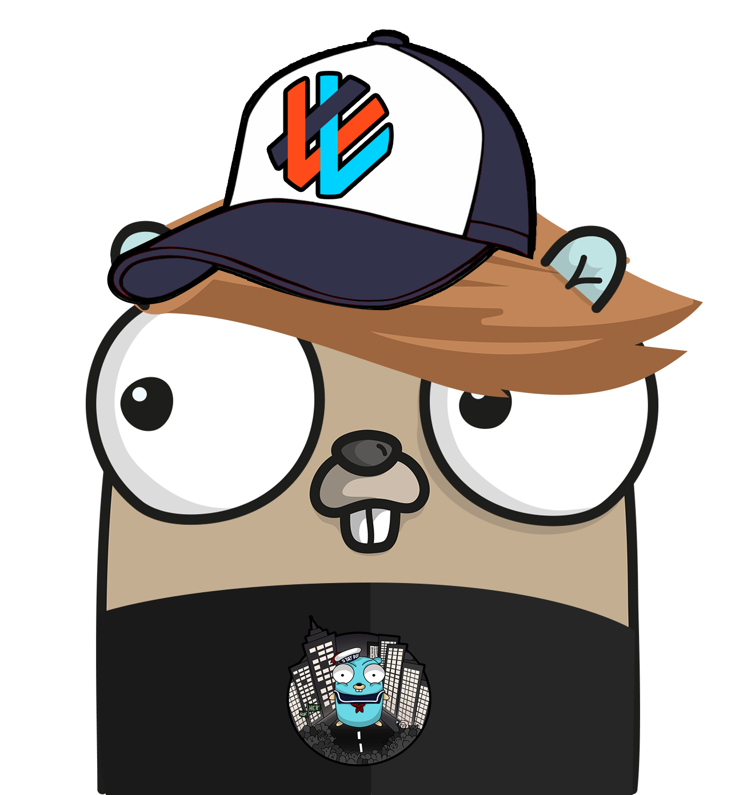

# gtag



[](https://travis-ci.com/wolfogre/gtag)
[](https://codecov.io/gh/wolfogre/gtag)
[](https://goreportcard.com/report/github.com/wolfogre/gtag)
[](https://github.com/wolfogre/gtag/blob/master/go.mod)
[](https://github.com/wolfogre/gtag/releases)

Help you to get golang struct's tags elegantly.

## Installing

Install gtag by running:

```bash
go get -u github.com/wolfogre/gtag/cmd/gtag
```

and ensuring that `$GOPATH/bin` is added to your `$PATH`.

## Tutorial

### 1. define your struct

A source file `user.go`:

```go
package tutorial

type User struct {
	Id    int    `bson:"_id"`
	Name  string `bson:"name"`
	Email string `bson:"email"`
}
```

## 2. run gtag

Run

```bash
gtag -types User -tags bson .
```

and you will get file user_tag.go:

```go
// Code generated by gtag. DO NOT EDIT.
// See: https://github.com/wolfogre/gtag

//go:generate gtag -types User -tags bson .
package tutorial

import "reflect"

var (
	// ...
)

type UserTags struct {
	Id    string
	Name  string
	Email string
}

func (User) Tags(tag string) UserTags {
	return UserTags{
		Id:    tagOfUserId.Get(tag),
		Name:  tagOfUserName.Get(tag),
		Email: tagOfUserEmail.Get(tag),
	}
}

func (v User) TagsBson() UserTags {
	return v.Tags("bson")
}
```

## 3. use it

Now you can use the generated code to get tags elegantly:

```go
// update mongo document
tags := User{}.TagsBson()

_, err := collection.UpdateOne(
    ctx,
    bson.M{tags.Id: id},
    bson.M{
        "$set", bson.M{
            tags.Name: name,
            tags.Email: email,
        },
    },
)
```

## Project status

Gtag is beta and is considered feature complete.
